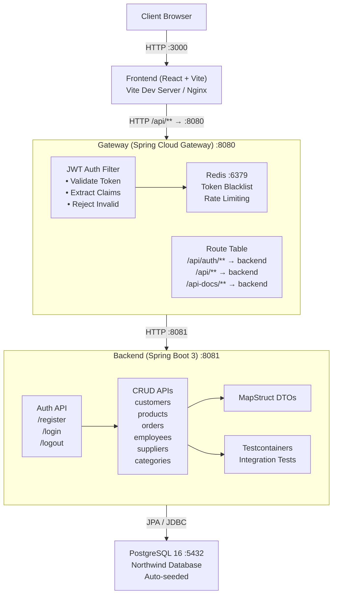
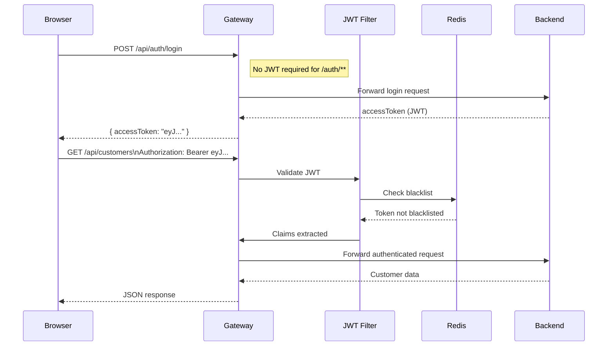
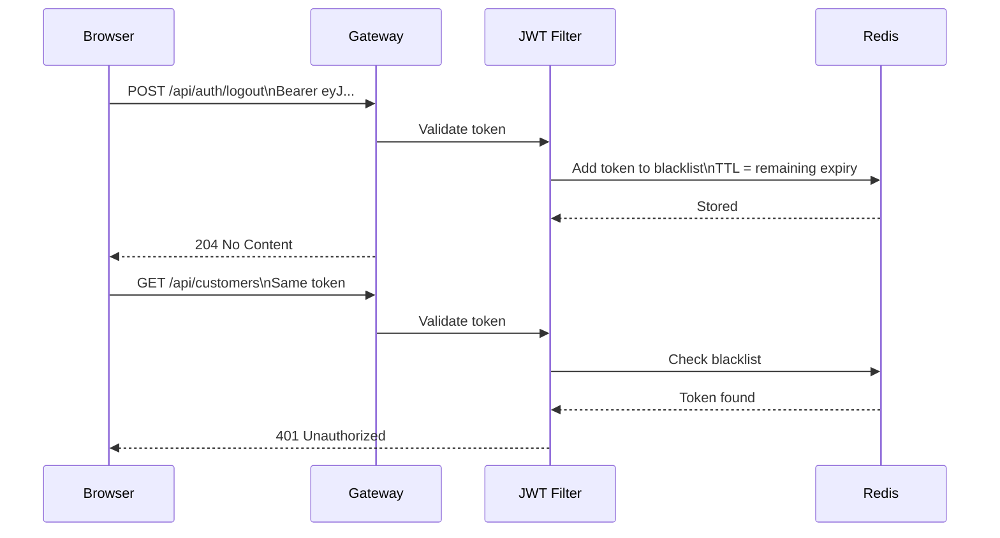

# MercurioX

A full-stack Northwind database management application built with a production-grade, security-first architecture. Features a Spring Cloud Gateway as the single entry point, JWT-based authentication, Redis-backed session management, and a React + Vite frontend — all orchestrated with Docker Compose.

---

## Architecture



---

## Request Flow

### Authenticated request


### Logout (token blacklisting)


---

## Tech Stack

| Layer | Technology |
|-------|-----------|
| Frontend | React 18, Vite, TypeScript |
| Gateway | Spring Cloud Gateway, Spring Boot 3.3.2 |
| Backend | Spring Boot 3.3.2, Spring Data JPA, Spring Security |
| Auth | JJWT 0.12.6 (JWT), Redis (token blacklist) |
| DTO Mapping | MapStruct 1.6.0 |
| Database | PostgreSQL 16 |
| Testing | JUnit 5, Testcontainers 1.20.1 |
| API Docs | SpringDoc OpenAPI 2.6.0 (Swagger UI) |
| Build | Maven (multi-module), Java 21 |
| Infrastructure | Docker, Docker Compose |

---

## Project Structure

```
MercurioX/
├── docker-compose.yml            ← production service definitions
├── docker-compose.override.yml   ← dev overrides (volumes, ports)
├── pom.xml                       ← parent POM, dependency management
├── .env.example                  ← required environment variables
├── .github/
│   └── workflows/                ← CI pipeline
├── init/
│   └── northwind.sql             ← database seed (auto-runs on first start)
├── gateway/                      ← Spring Cloud Gateway module
│   ├── Dockerfile
│   └── src/
│       └── ...                   ← JWT filter, route config, Redis integration
├── backend/                      ← Spring Boot API module
│   ├── Dockerfile
│   └── src/
│       └── ...                   ← controllers, services, repositories, DTOs
└── frontend/                     ← React + Vite app
    └── src/
        └── ...                   ← pages, components, API client
```

---

## Quick Start

### Prerequisites
- Docker and Docker Compose installed
- Git

### 1. Clone

```bash
git clone https://github.com/saMM7111/MercurioX.git
cd MercurioX
```

### 2. Configure environment

```bash
cp .env.example .env
# Edit .env — at minimum set a strong JWT_SECRET (32+ characters)
```

Required variables:

```env
POSTGRES_DB=northwind
POSTGRES_USER=northwind
POSTGRES_PASSWORD=your-secure-password

# Must be at least 32 characters for HS256 signing
JWT_SECRET=your-very-long-secret-key-change-this-now
```

### 3. Run

```bash
docker-compose up --build
```

---

## Deploy to Railway

This repo deploys cleanly to Railway as a multi-service project:

- **postgres** (Railway PostgreSQL service)
- **redis** (Railway Redis service)
- **backend** (Spring Boot, Dockerfile)
- **gateway** (Spring Cloud Gateway, Dockerfile)
- **frontend** (Nginx serving Vite build + reverse proxy `/api` → gateway)

### 1) Create the Railway project

1. Create a new Railway project and connect this GitHub repo.
2. Add 3 services from the repo:
    - `backend` (root directory: `/`)
    - `gateway` (root directory: `/`)
    - `frontend` (root directory: `/`)
3. Add 2 database services from Railway:
    - PostgreSQL
    - Redis

Tip: rename the services to exactly `postgres`, `redis`, `backend`, `gateway`, `frontend` so private DNS names are predictable (`backend.railway.internal`, etc.).

### 2) Configure each service (build + config path)

Railway config paths in a monorepo must be **absolute**.

- **backend**: set Railway Config Path to `/railway.backend.toml`
- **gateway**: set Railway Config Path to `/railway.gateway.toml`
- **frontend**: set Railway Config Path to `/railway.frontend.toml`

### 3) Set environment variables

Create a strong shared JWT secret and share it with **backend** and **gateway**.

**Shared (recommended)**

```env
JWT_SECRET=change-me-to-a-32+-char-secret
```

**backend service variables**

```env
SPRING_PROFILES_ACTIVE=prod
POSTGRES_HOST=postgres.railway.internal
POSTGRES_PORT=5432
POSTGRES_DB=<your-db-name>
POSTGRES_USER=<your-db-user>
POSTGRES_PASSWORD=<your-db-password>
```

**gateway service variables**

```env
REDIS_HOST=redis.railway.internal
REDIS_PORT=6379
# Recommended: reference the backend service's runtime port
BACKEND_URI=http://backend.railway.internal:${{ backend.PORT }}
```

**frontend service variables**

```env
# Recommended: reference the gateway service's runtime port
GATEWAY_URL=http://gateway.railway.internal:${{ gateway.PORT }}
```

### 4) Deploy order

1. Deploy `postgres` and `redis` first.
2. Deploy `backend` (it will run Flyway migrations).
3. Deploy `gateway`.
4. Deploy `frontend`.

### 5) Access the app

Use the **frontend** public domain URL from Railway.

The frontend proxies `/api/*` to the gateway, so the browser stays **same-origin** and the httpOnly refresh cookie works.

All services start in the correct order — Postgres first (health-checked), then Backend (health-checked), then Gateway, then Frontend.

### 4. Access

| Service | URL |
|---------|-----|
| Frontend | http://localhost:3000 |
| API (via Gateway) | http://localhost:8080/api |

### Demo credentials (auto-seeded)

| Role | Username | Password |
|------|----------|----------|
| Admin | `admin` | `Passw0rd!` |
| User | `user` | `Passw0rd!` |

### Stop

```bash
docker-compose down        # stop containers
docker-compose down -v     # stop + wipe database volume
```

---

## API Reference

### Auth endpoints (no JWT required)

| Method | Path | Description |
|--------|------|-------------|
| `POST` | `/api/auth/register` | Register new user |
| `POST` | `/api/auth/login` | Login → returns JWT |
| `POST` | `/api/auth/logout` | Invalidate token (blacklisted in Redis) |

### Data endpoints (JWT required)

All data endpoints follow REST conventions:

| Method | Path | Description |
|--------|------|-------------|
| `GET` | `/api/{entity}` | List all records |
| `GET` | `/api/{entity}/{id}` | Get by ID |
| `POST` | `/api/{entity}` | Create |
| `PUT` | `/api/{entity}/{id}` | Full update |
| `DELETE` | `/api/{entity}/{id}` | Delete |

Entities: `customers` · `products` · `orders` · `employees` · `suppliers` · `categories`

### Example — authenticated request

```bash
# Login
TOKEN=$(curl -s -X POST http://localhost:8080/api/auth/login \
  -H "Content-Type: application/json" \
  -d '{"username":"admin","password":"Passw0rd!"}' \
  | jq -r '.accessToken')

# Use token
curl http://localhost:8080/api/customers \
  -H "Authorization: Bearer $TOKEN"
```

---

## Security Design

**JWT authentication**
- Tokens signed with HS256 using a configurable secret (minimum 32 chars)
- Gateway validates every request to `/api/**` except `/api/auth/**`
- Claims extracted at the gateway — backend trusts forwarded headers

**Token blacklisting via Redis**
- On logout, the token is stored in Redis with TTL = remaining expiry time
- Gateway checks Redis on every request — blacklisted tokens are rejected immediately
- Stateless JWT + stateful blacklist = best of both approaches

**No direct backend exposure**
- Backend runs on port `8081` and is not published to the host in production
- All traffic must pass through the Gateway on port `8080`

**Secret management**
- All credentials are environment variables, never hardcoded
- `.env.example` documents required variables without exposing values
- `.env` is gitignored

---

## Development

For local development with hot reload:

```bash
# Override docker-compose runs the frontend with Vite HMR
# and mounts source directories as volumes
docker-compose up
```

The `docker-compose.override.yml` is automatically applied and provides:
- Frontend: Vite HMR (changes reflect instantly, no rebuild)
- Backend: source mounts for faster iteration

---

## Design Decisions

**Why a dedicated Gateway module?**
Authentication, routing, and cross-cutting concerns (rate limiting, CORS, logging) belong at the edge — not scattered across service code. The gateway is the single enforcement point. The backend can focus purely on business logic.

**Why Redis for token blacklisting?**
Pure JWT is stateless but can't revoke tokens before expiry. A database blacklist works but adds SQL round-trips on every request. Redis provides O(1) key lookup with automatic TTL expiry, making it the right tool for this use case.

**Why MapStruct over manual mapping?**
JPA entities should never be exposed directly as API responses — they leak internal schema, create lazy-loading pitfalls, and make API contracts fragile. MapStruct generates compile-time DTO mappers with zero reflection overhead.

**Why Testcontainers over H2?**
H2 in-memory databases don't behave identically to PostgreSQL — dialect differences cause subtle bugs that only surface in production. Testcontainers spins up a real Postgres instance for each test run, eliminating that entire class of bugs.
